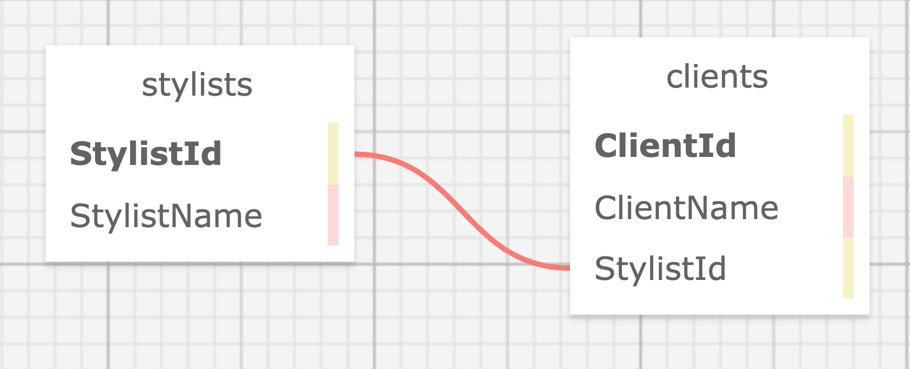

# Eau Claire's Salon

### A C# Salon Managment Application.

#### By Brianca Knight

## Technologies Used

* C#
* .Net 6
* ASP.Net / MVC
* Entity Framework Core
* MySQL
* MySQL Workbench

## Description

This webpage provides a client and stylist organizing system utilizing MVC pattern. Users can add new stylists, add new clients to each stylist, and see lists of each. Additionally, users can search the database for both stylists and clients.  

Here is a diagram of the schema structure:



## Setup/Installation Requirements

This project assumes you have MySQL and MySQL Workbench installed on your system. If you do not, follow along with the installation steps outlined in this lesson [LearnHowToProgram](https://full-time.learnhowtoprogram.com/c-and-net/getting-started-with-c/installing-and-configuring-mysql).

### Set up Database

* Import the brianca_knight.sql file located in the root level of this directory to your computer. 

* Open MySQL Workbench and navigate to the Administration tab in the Navigator window and select `Data Import/Restore`

* Under Import Options select `Import from Self-Contained File` and path to the `brianca_knight.sql` file that you downloaded from this repository.

* Under `Default Schema to be imported to` select the `New` button. In the new window that opens, enter in  the database's  name `brianca_knight`

* Navigate to the tab called `Import Progress` and click `Start Import`

* Refresh your Navigator window to see your new schema present. 

### Set Up App

* Clone this repo from `https://github.com/BriancaKnight/HairSalon.Solution`.

* In the production sub directory (named `HairSalon`) create a file named `appsettings.json` and add the following code to it:

 ```json
    {
      "ConnectionStrings": {
          "DefaultConnection": "Server=localhost;Port=3306;database=brianca_knight;uid=[USERNAME];pwd=[PASSWORD];"
      }
    }
   ```

   Make sure to update the string with your own values for [USERNAME] and [PASSWORD], without square brackets. 

* In the terminal run the command `dotnet watch run` to compile and run the application in development mode with a watcher. Optionally, you can run `dotnet build` to compile without running the app. 

* Open the browser to https://localhost:5001 to use the application. 

## Known Bugs
* None.

## License

[](https://opensource.org/licenses/MIT)

Copyright (c) 2023 Brianca Knight

